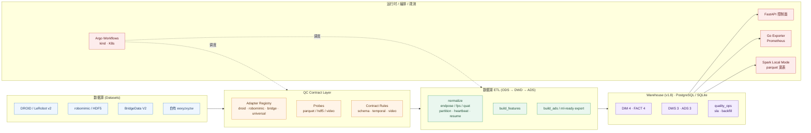

<div align="center">

# Robot Data Harness

**面向 Kubernetes 的多源机器人数据质量与评测平台**

<sub>从原始数据集到 ML-ready Parquet：QC 合约 · 数据湖 ETL · Argo DAG · 数仓 14 表 · Spark 离线宽表</sub>

<p>
  
  
  
  
  
  
</p>

</div>

---

## 项目简介

`robot-data-harness` 把异构机器人数据集（DROID / LeRobot v2、robomimic / HDF5、BridgeData V2、自有 `eexyzxyzw`）汇入统一的 **QC 合约 → 数据湖 ETL → 数据仓库 → ML-ready 导出** 流水线，并在 **kind / Kubernetes + Argo Workflows** 上原生运行。

主要解决三类问题：

- **数据质量不可对账**：多源数据集 schema / 时空指标各异，缺统一规则与契约门禁。
- **大规模 ETL 不可恢复**：30 GiB 跨公网 normalize / features 容易因 `DeadlineExceeded` 重头再来。
- **运行时指标无法沉淀为仓库**：Argo / ETL 事件流散落在日志里，无法长期分析 SLA、补数与质量趋势。

## 核心特性

<table>
<tr>
<td width="50%" valign="top">

**多源 QC Contract Layer**

按 `universal / droid / robomimic / bridge` 四套规则跑 schema / 时序 / 视频探针，结果落 `qc_contracts` / `qc_contract_runs` / `fact_qc_rule_result`。

**可恢复 Scale ETL**

`normalize → features → ads` 三段流水，支持 partition planner、heartbeat / checkpoint、断点续跑（`--resume`）、本地 file URI 直读。

**Argo Multi-Source DAG**

`robot-dh-multisource-scale30` / `robot-dh-local-devscale` 两套 WorkflowTemplate，自带 `archiveLogs` 闭环 + `podGC=OnWorkflowCompletion` + step pod 进度心跳。

</td>
<td width="50%" valign="top">

**数据仓库 14 表（v1.8）**

`DIM 4 · FACT 4 · DWS 3 · ADS 3`，本地 SQLite / 远端 PostgreSQL 共用一套 ORM 与 builder；UPSERT 幂等。

**Quality / SLA / Backfill 全链路**

CLI + FastAPI 只读端点：`quality summary/report`、`sla check/report`、`backfill plan/status/run`。

**Spark Local Mode 离线宽表**

`pyspark + JDK 11` 无 Hadoop / Hive，复用 warehouse export 的 parquet，产出 DWS / ADS 给 Grafana / DuckDB / Trino / Superset 直读。

</td>
</tr>
<tr>
<td valign="top">

**ML-ready Export**

`robot-dh ml-ready export` 输出 train / val / test parquet + `dataset_card.{json,md}` + `lineage.json`。

</td>
<td valign="top">

**Prometheus Exporter**

独立 Go 服务 `robot-dh-exporter`，暴露 30+ 指标覆盖 contract / workflow / asset / ml-ready / heartbeat。

</td>
</tr>
</table>

## 架构总览



<details>
<summary><b>分层职责说明</b></summary>

| 层 | 说明 | 关键产物 |
| --- | --- | --- |
| 数据源 | 公开 / 自建多源数据集 | `s3://robot-datasets/<family>/<id>/<version>/...` 或 `file://` |
| QC | 合约门禁与数据画像 | `fact_qc_rule_result`、`asset_profiles`、`contract_report.json` |
| ETL | 标准化 → 特征 → ADS | `lake/{ods,dwd,ads}/<id>/<version>/*.parquet` |
| 仓库 | 14 张离线 / 在线指标表 | `dws_dataset_quality_daily`、`ads_quality_dashboard` 等 |
| 运行时 | 调度 / 控制面 / 指标 | Argo DAG、`/quality/summary`、Prometheus `/metrics` |

</details>

## 快速开始

> 需要 Python 3.10+。完整本地链路（含远端 PostgreSQL / MinIO / Redis、kind、Argo）请参见 [`README.dev.md`](README.dev.md)。

### 1. 安装

```bash
git clone https://github.com/<your-org>/robot-data-harness.git
cd robot-data-harness
make setup
```

### 2. 跑一个最小 end-to-end（纯本地，无云依赖）

```bash
python scripts/generate_demo_dataset.py --output runs/demo/raw_demo

robot-dh qc contract run \
    --dataset-family universal \
    --dataset-uri "file://$PWD/runs/demo/raw_demo" \
    --dataset-id demo_e2e --version v1 \
    --output "file://$PWD/runs/demo/qc_out"

robot-dh etl run \
    --dataset "file://$PWD/runs/demo/raw_demo" \
    --dataset-id demo_e2e --version v1 \
    --lake-root "file://$PWD/runs/demo/lake" --build-ads

robot-dh warehouse init  --config configs/warehouse.yaml
robot-dh warehouse build --config configs/warehouse.yaml \
    --from-date "$(date -u +%F)" --to-date "$(date -u +%F)" \
    --layers dim,fact,dws,ads

robot-dh quality report --date "$(date -u +%F)" --output runs/demo/quality_report
```

打开 `runs/demo/quality_report/quality_summary_*.html` 即可看到质量大屏。

### 3. 启动 FastAPI 控制面

```bash
uvicorn robot_dh.api.main:app --host 0.0.0.0 --port 8000

curl -s "http://localhost:8000/warehouse/tables"            | jq
curl -s "http://localhost:8000/quality/summary?date=$(date -u +%F)" | jq
```

### 4. 跑测试

```bash
make test     # 363 passed / 17 skipped（远端 / spark 集成测试默认 skip）
```

## 支持的数据集 & 运行模式

<table>
<tr><th width="33%">数据集 / 适配器</th><th width="33%">运行模式</th><th width="33%">存储后端</th></tr>
<tr>
<td>

- DROID / LeRobot v2
- robomimic (HDF5)
- BridgeData V2
- Universal (`eexyzxyzw`)
- 通过 `RobotDatasetAdapter` 注册表自动嗅探

</td>
<td>

- 本地 SQLite + 本地 artifact
- WSL 公网直连 PostgreSQL / MinIO / Redis
- kind / K8s Job + Argo Workflows
- 本地 Local-First Runtime（`≤ 3 GiB devscale`）
- 远端 Scale30 压测路径

</td>
<td>

- 注册表：SQLite / PostgreSQL
- Artifact / Lake：本地 FS / S3 / MinIO
- 缓存：Redis（可选）
- Parquet / HDF5 / mp4
- 数仓：SQLite / PostgreSQL（共用 builder）

</td>
</tr>
</table>

## CLI 速查

| 模块 | 命令 | 说明 |
| --- | --- | --- |
| Validate | `robot-dh validate` / `scan` | 单数据集或目录扫描验证（v1.3） |
| Dataset | `robot-dh dataset register/list` | 数据集注册表（SQLite / PG） |
| Lake / ETL | `robot-dh etl run --phase normalize\|features\|ads` | 三段式 ETL，支持 `--resume` |
| Partition | `robot-dh partition plan / run-normalize` | sharded normalize，断点续跑 |
| QC | `robot-dh qc contract run / profile / report` | 多源 QC 合约门禁 |
| ML-ready | `robot-dh ml-ready export / list / show` | train/val/test parquet + dataset_card |
| Warehouse | `robot-dh warehouse init / build / export / query` | 14 张数仓表 |
| Quality | `robot-dh quality summary / report` | JSON / HTML 质量日报 |
| SLA | `robot-dh sla check / report` | 策略校验与告警 |
| Backfill | `robot-dh backfill plan / status / run` | 补数计划与执行 |
| Spark | `robot-dh spark build-quality-ads` | local mode 离线宽表 |
| Argo | `robot-dh argo sync` | 把 Argo 状态写回 PG |
| Local | `robot-dh local runtime doctor` 等 | 本地 devscale 运行时巡检 |
| API | `uvicorn robot_dh.api.main:app` | FastAPI 控制面（健康 / 只读查询） |

## 仓库结构（简）

```
robot-data-harness/
├── src/robot_dh/
│   ├── adapters/         # 多源 dataset 适配器注册表
│   ├── api/              # FastAPI 控制面
│   ├── argo/             # workflow 状态回写 PG
│   ├── etl/              # normalize / features / ads / runner / lineage
│   ├── lake/             # S3LakeStore / file URI / hf_adapters
│   ├── ml_ready/         # train/val/test 导出
│   ├── partition/        # partition planner
│   ├── progress/         # heartbeat / checkpoint
│   ├── qc/               # contract / probe / dataset metrics
│   ├── quality_ops/      # quality / sla / backfill（v1.8）
│   ├── spark_jobs/       # SparkSQL local mode 离线宽表
│   ├── warehouse/        # ORM models + builder
│   └── warehouse_metrics/# DIM/FACT/DWS/ADS builder
├── argo/                 # WorkflowTemplate / CronWorkflow
├── configs/              # qc 合约 / warehouse / sla 策略 / etl 默认
├── docker/Dockerfile
├── docs/                 # 设计文档与历史交接
├── go/robot-dh-exporter/ # Go Prometheus exporter
├── k8s/                  # Deployment / Job / CronJob
├── postgres/migrations/  # PG schema 迁移
├── warehouse/            # SQL DML 模板（PG + Spark）
├── tests/                # pytest（363 passed / 17 skipped）
├── Makefile              # 一键入口
└── README.dev.md         # 仓库开发详细文档
```

## 文档

- [`README.dev.md`](README.dev.md) — 完整开发文档（CLI 全量参数、API 参考、Makefile 目标、故障排查、版本演进 v1.3 → v1.8、端到端命令清单）
- [`docs/`](docs/) — 设计文档与版本交接（v1.4 数据湖、v1.5 Argo、v1.6 多源平台、v1.7 Local-First、v1.8 数仓 / SLA / quality ops）
- [`argo/README.md`](argo/README.md) — Argo WorkflowTemplate 使用与提交流程
- [`warehouse/spark/README.md`](warehouse/spark/README.md) — Spark local mode 离线宽表（可选）

## 版本演进

| 版本 | 关键能力 |
| --- | --- |
| **v1.3** | validator pipeline / registry / artifact store / FastAPI / kind |
| **v1.4** | 数据湖 ETL（ODS / DWD / ADS）、`lake_assets`、`lineage_edges` |
| **v1.5** | Sharded ETL、Benchmark、Argo Workflows、runtime profiler |
| **v1.6** | 多源 QC Contract、ML-ready、Argo Multi-Source DAG、Prometheus exporter |
| **v1.7** | Local-First Runtime、Adapter Registry、本地 file URI 一等公民、Argo Local DAG |
| **v1.8** | 数仓 14 表（DIM/FACT/DWS/ADS）、quality / SLA / backfill、Spark local mode 宽表 |

## License

本仓库目前用于内部开发与评测，未指定开源 License；如需引用或集成，请先联系仓库维护者。

---

<div align="center">
<sub>
Robot Data Harness · 端到端机器人数据质量评测平台 ·
<a href="README.dev.md">开发者文档</a> ·
<a href="docs/">设计文档</a>
</sub>
</div>
